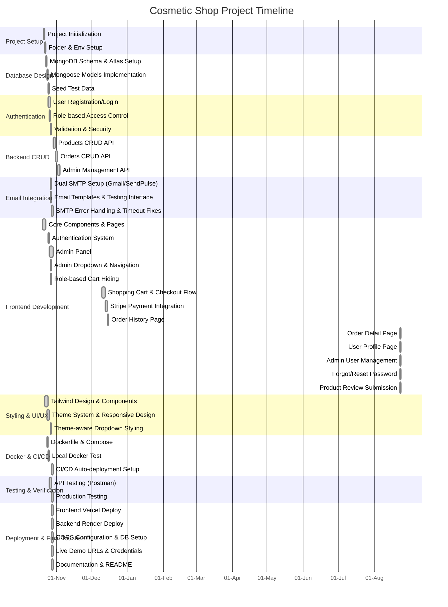

# Project Timeline – Gantt Chart

---

## Notes
- Project started **October 21, 2025**; core features completed by **October 28, 2025**.
- Shopping cart, checkout flow, and Stripe payment integration (sandbox mode) added **December 10–15, 2025**, following the mentor's request to include payment processing in the project scope.
- Order detail page and user profile management added **August 23, 2026**, closing out the two frontend gaps identified during a review of the project's task-tracking docs.
- Admin dashboard, admin user management, advanced product filtering UI, and newsletter sending also added **August 23, 2026**.
- Forgot/reset password (end-to-end) and product review submission added **August 23, 2026**, after a full audit against the plan, TODO, mentor's proposal, and actual code turned up a broken login-page link (unsent reset email) and a read-only reviews section with no submission path.
- Total development time: approximately 130 hours completed out of 130 estimated.
- Most tasks completed ahead of schedule with successful production deployment.
- **Live Demo**: Frontend on Vercel, Backend on Render with MongoDB Atlas.
- **Remaining**: performance optimization and monitoring (optional future improvement, out of thesis scope).

---
