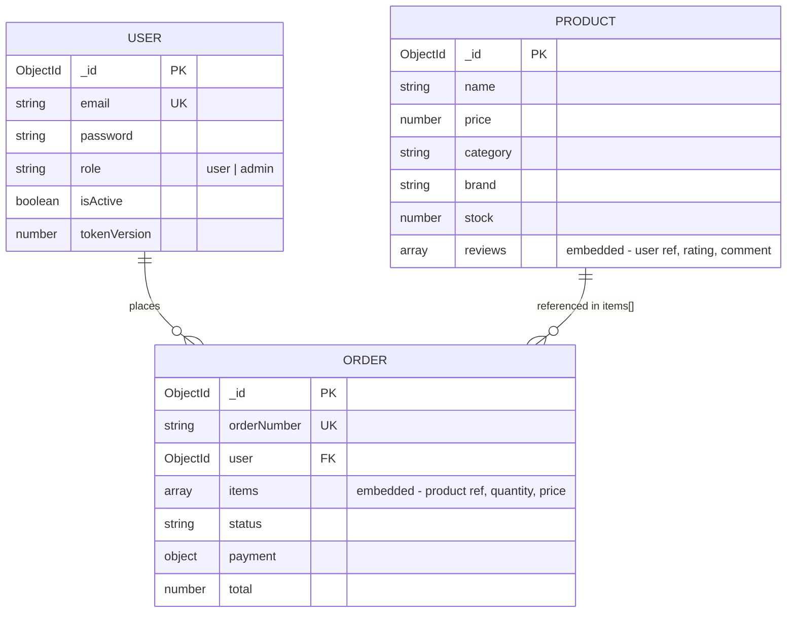
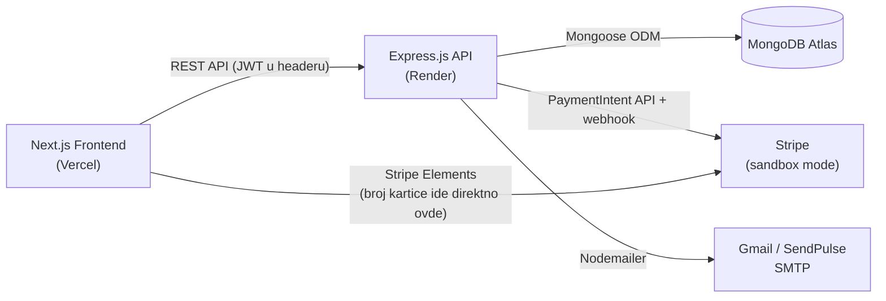
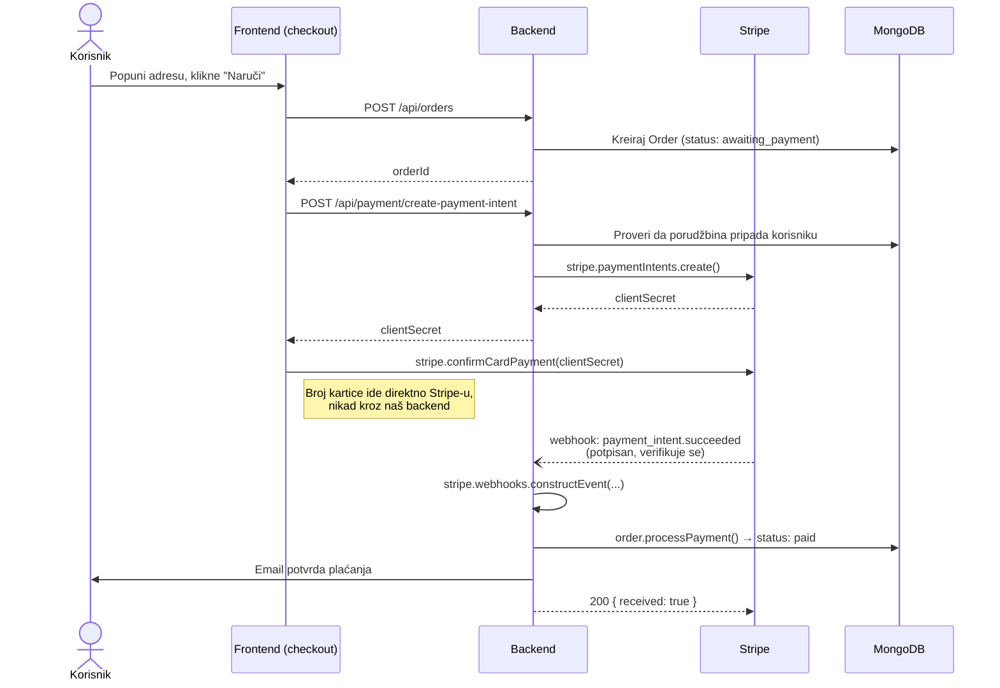
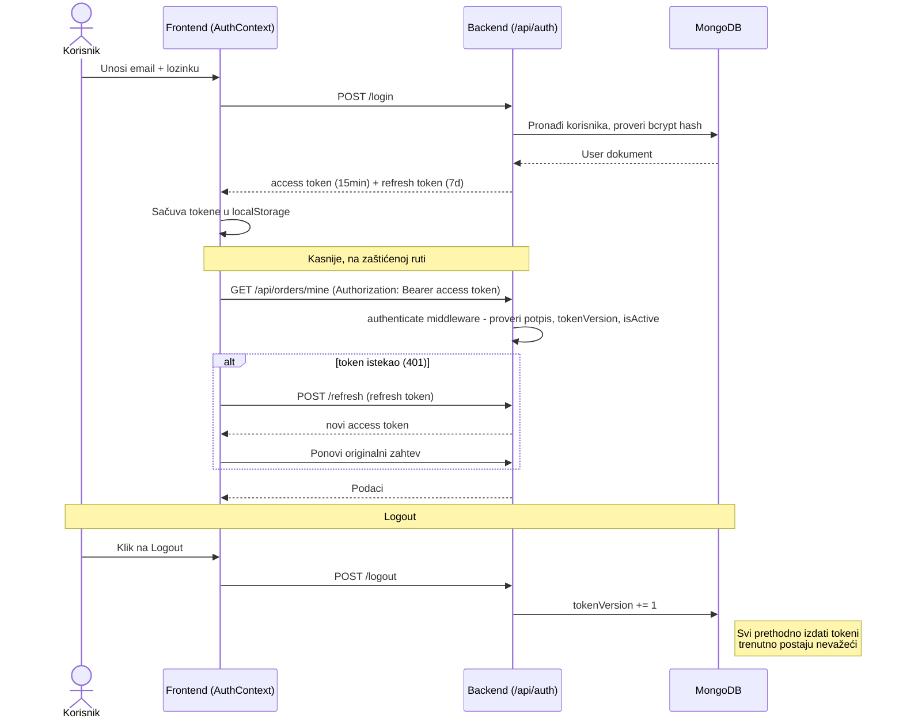

# Projektna dokumentacija - SveVišnja Kozmetika

## 1. Uvod

**SveVišnja Kozmetika** (repo/tehnički naziv: `cosmetic-shop`) je full-stack web aplikacija za online prodaju kozmetičkih proizvoda - korisnici pregledaju proizvode, dodaju ih u korpu, plaćaju karticom i prate status porudžbine, dok administratori upravljaju proizvodima, korisnicima, porudžbinama i newsletter-om.

Cilj je bio da aplikacija bude funkcionalna i vizuelno uredna, uz tehnologije i pristupe koji se realno koriste u industriji, ne samo "za potrebe teze": odvojen frontend i backend, JWT autentifikacija sa role-based pristupom (guest/user/admin), dual SMTP sistem za pouzdaniju isporuku mejlova (kad Gmail zakaže, SendPulse preuzima slanje), i potpuno dockerizovano okruženje koje se automatski deploy-uje preko CI/CD pipeline-a na Vercel (frontend) i Render (backend).

**Live Demo:**
- Frontend (Vercel): https://cosmetic-shop-votis.vercel.app/
- Backend API (Render): https://cosmetic-shop-54ju.onrender.com
- GitHub Repository: https://github.com/angy-k/cosmetic-shop

**Demo Login Credentials:**
- **Admin User:** admin@cosmeticshop.com / admin123
- **Classic User:** classic@cosmeticshop.com / admin123

## 2. Opis korišćenih tehnologija

### 2.0 Pregled tehnološkog stack-a

| Sloj | Tehnologija | Opis |
|------|-------------|------|
| Frontend | Next.js (React Framework) | Server-side rendered React aplikacija za SEO optimizaciju |
| Stilizacija | Tailwind CSS | Moderan, responzivni UI framework |
| Backend | Node.js + Express.js | RESTful API implementacija sa autentifikacijom i CRUD funkcionalnostima |
| Baza podataka | MongoDB Atlas | Cloud-hosted NoSQL baza podataka |
| Email sistem | SendPulse + Gmail + Nodemailer | Email notifikacije za potvrdu narudžbina i dostupnost |
| Plaćanje | Stripe (sandbox/test mode) | Procesiranje kartičnih plaćanja preko PaymentIntents API-ja i Stripe Elements-a |
| Interne notifikacije | Slack (Incoming Webhooks) | Real-time obaveštenja administratoru o novim porudžbinama, uspešnim/neuspešnim plaćanjima i greškama u aplikaciji |
| Hosting | Vercel (frontend), Render (backend) | Serverless, skalabilna deployment okruženja |
| CI/CD | GitHub Actions | Automatski build, test i deployment workflow |
| Containerization | Docker + docker-compose | Konzistentna lokalna i production okruženja |

### 2.1 Baza podataka
**MongoDB Atlas** - Cloud-hosted NoSQL baza podataka
- **Verzija:** MongoDB 7.x
- **Hosting:** MongoDB Atlas (cloud baza) - koristi se za čuvanje svih podataka o korisnicima, proizvodima, korpama i porudžbinama
- **ODM:** Mongoose 8.19.1 za objektno modelovanje
- **Prednosti:** Laka integracija, sigurnost i dostupnost bez potrebe za lokalnom instalacijom
- **Karakteristike:**
  - Automatsko kreiranje indeksa
  - Validacija podataka na nivou baze
  - Agregacija pipeline za kompleksne upite
  - Replica set za high availability

### 2.2 Backend tehnologije
**Node.js + Express.js** - Server-side aplikacija
- **Node.js:** Runtime environment za JavaScript
- **Express.js 5.1.0:** Web framework za API development - omogućavaju razvoj REST API-ja koji povezuje frontend sa bazom podataka i servisima trećih strana
- **JWT (JSON Web Token):** Implementacija autentifikacije i autorizacije za različite korisničke uloge
- **Ključne biblioteke:**
  - `bcryptjs` - Hash-ovanje lozinki
  - `jsonwebtoken` - JWT token management
  - `mongoose` - MongoDB ODM
  - `nodemailer` - Email funkcionalnost
  - `express-validator` - Input validacija
  - `express-rate-limit` - Rate limiting za API
  - `cors` - Cross-Origin Resource Sharing
  - `dotenv` - Environment varijable

### 2.3 Frontend tehnologije
**Next.js + React** - Modern frontend framework
- **Next.js 15.5.6:** React framework sa App Router - omogućava server-side rendering (SSR) i SEO optimizaciju proizvoda i kategorija
- **React 19.1.0:** Najnovija verzija React biblioteke
- **Tailwind CSS 4:** Utility-first CSS framework - koristi se za moderan, responzivan i čist dizajn korisničkog interfejsa
- **Axios:** Za komunikaciju sa backend API servisima
- **Karakteristike:**
  - Server-side rendering (SSR)
  - Static site generation (SSG)
  - Automatic code splitting
  - Built-in optimizacije za performanse
  - Modern React features (Suspense, Concurrent Features)

### 2.4 Email sistem
**Dual SMTP konfiguracija** - Pouzdana dostava email-ova
- **Primary:** Gmail SMTP (development)
- **Backup:** SendPulse SMTP (production)
- **Nodemailer + SendPulse SMTP:** Omogućavaju slanje email potvrda o porudžbinama i obaveštenja o dostupnosti proizvoda
- **Automatski failover:** Ako primary ne radi, automatski prebacuje na backup
- **Funkcionalnosti:**
  - Automatski email nakon uspešne porudžbine
  - Obaveštenja o dostupnosti proizvoda
  - Admin notifikacije o statusu porudžbine

### 2.5 Deployment i DevOps
**Containerization i Cloud Hosting**
- **Docker:** Containerization sa multi-stage builds - kontejnerizacija backend servisa i baze za jednostavno pokretanje i testiranje
- **Docker Compose:** Orchestration za development
- **Frontend hosting:** Vercel (Next.js nativna platforma)
- **Backend hosting:** Render (Dockerized Express server)
- **CI/CD:** GitHub Actions za automatski deployment
  - Frontend se automatski build-uje i deploy-uje na Vercel nakon svakog commit-a u main granu
  - Backend se deploy-uje na Render i restartuje kontejner sa novom verzijom aplikacije
- **Postman:** Za testiranje API zahteva
- **Monitoring:** Health check endpoints

## 3. Opis procesa izrade projekta

### 3.1 Struktura baze podataka

Baza podataka koristi MongoDB sa sledećim kolekcijama:
- `users` – informacije o korisnicima (ime, email, lozinka, uloga)
- `products` – detalji o proizvodima (naziv, opis, cena, slika, status dostupnosti)
- `orders` – podaci o porudžbinama, povezan sa korisnikom i proizvodima
- `cart` – privremeno skladište proizvoda koje korisnik dodaje pre kreiranja porudžbine

**Glavna tri entiteta:**

#### User Model (Korisnici)
```javascript
{
  _id: ObjectId,
  email: String (unique, required),
  password: String (hashed),
  firstName: String,
  lastName: String,
  role: String (enum: ['user', 'admin']),
  isEmailVerified: Boolean,
  refreshTokens: [String],
  createdAt: Date,
  updatedAt: Date
}
```

**Ključni indeksi:**
- `email` (unique)
- `role`

**Sigurnosne mere:**
- bcrypt hash za lozinke (salt rounds: 12)
- Email validacija
- Refresh token management

#### Product Model (Proizvodi)
```javascript
{
  _id: ObjectId,
  name: String (required),
  description: String,
  price: Number (required, min: 0),
  category: String (enum: ['skincare', 'makeup', 'fragrance', 'haircare']),
  brand: String,
  sku: String (unique, auto-generated),
  stock: Number (default: 0),
  images: [String], // URLs ili base64
  ingredients: [String],
  isActive: Boolean (default: true),
  reviews: [{
    user: ObjectId (ref: 'User'),
    rating: Number (1-5),
    comment: String,
    createdAt: Date
  }],
  averageRating: Number,
  totalReviews: Number,
  createdAt: Date,
  updatedAt: Date
}
```

**Ključni indeksi:**
- `sku` (unique)
- `category`
- `brand`
- `isActive`

**Business logika:**
- Automatska SKU generacija
- Kalkulacija prosečne ocene
- Stock management

#### Order Model (Narudžbine)
```javascript
{
  _id: ObjectId,
  orderNumber: String (unique, auto-generated),
  user: ObjectId (ref: 'User'),
  items: [{
    product: ObjectId (ref: 'Product'),
    quantity: Number,
    price: Number
  }],
  subtotal: Number,
  tax: { amount: Number, rate: Number },
  shipping: { cost: Number, method: String },
  total: Number,
  status: String (enum: ['pending', 'awaiting_payment', 'paid', 'confirmed', 'processing', 'shipped', 'delivered', 'cancelled', 'refunded', 'returned']),
  payment: {
    method: String (enum: ['credit-card', 'debit-card', 'paypal', 'stripe', 'cash-on-delivery']),
    status: String (enum: ['pending', 'processing', 'completed', 'failed', 'refunded']),
    transactionId: String,
    stripePaymentIntentId: String,
    stripeCustomerId: String,
    paidAt: Date
  },
  shipping: {
    address: {
      street: String,
      city: String,
      postalCode: String,
      country: String
    },
    method: String (enum: ['standard', 'express', 'overnight', 'pickup']),
    trackingNumber: String,
    estimatedDelivery: Date
  },
  createdAt: Date,
  updatedAt: Date
}
```

**Ključni indeksi:**
- `orderNumber` (unique)
- `user`
- `status`
- `createdAt`

#### Logička šema podataka (ER stil)

Napomena pre dijagrama: MongoDB nema strane ključeve ni JOIN na nivou baze, pa ovo nije "pravi" ER dijagram u klasičnom (relacionom) smislu - baza sama ne garantuje referencijalni integritet između `USER`/`PRODUCT`/`ORDER`. Dijagram je logički prikaz kako su entiteti povezani u aplikaciji, adaptiran za dokument model: `items` unutar `Order` i `reviews` unutar `Product` nisu posebne kolekcije nego ugnježdeni nizovi (embedded dokumenti) - MongoDB dozvoljava da se podaci koji "pripadaju" jednom entitetu ugnježde direktno unutar njega, umesto da se za svaku sitnicu pravi zasebna kolekcija sa referencom kao u relacionoj bazi.



### 3.2 Backend logika

#### 3.2.1 Arhitektura
Projekat koristi **MVC (Model-View-Controller)** arhitekturu:

```
backend/src/
├── controllers/     # Business logika
├── middleware/      # Custom middleware
├── models/         # Mongoose modeli
├── routes/         # API rute
├── services/       # Servisni sloj
└── utils/          # Utility funkcije
```

Šire gledano, sistem izgleda ovako - frontend i backend su potpuno odvojeni procesi koji komuniciraju preko REST API-ja, a backend dalje komunicira sa bazom i spoljnim servisima:



Bitna stvar na ovom dijagramu: broj kartice nikad ne prolazi kroz moj backend - frontend komunicira sa Stripe-om direktno preko Stripe Elements-a, a backend samo kreira PaymentIntent i kasnije prima webhook o ishodu (detaljnije u 3.2.2, pod Payment Routes).

#### 3.2.2 API rute

Backend sadrži REST API sa osnovnim **CRUD operacijama** nad kolekcijama proizvoda i porudžbina:
- **Create:** dodavanje novih proizvoda ili kreiranje porudžbine
- **Read:** prikaz proizvoda, detalja o porudžbini i korisničkih podataka
- **Update:** izmena informacija o proizvodima ili statusa porudžbine
- **Delete:** brisanje proizvoda ili korisnika (samo administrator)

**Authentication Routes (`/api/auth`)**
- `POST /register` - Registracija korisnika
- `POST /login` - Prijava korisnika
- `POST /logout` - Odjava korisnika (invalidira postojeće refresh tokene inkrementiranjem `tokenVersion`)
- `POST /refresh` - Refresh access tokena
- `GET /me` - Podaci o ulogovanom korisniku (koristi se za proveru sesije pri učitavanju aplikacije)
- `PUT /profile` - Izmena profila (ime, telefon, preference) - koristi se na `/profile` stranici
- `PUT /change-password` - Promena lozinke (ulogovan korisnik) - koristi se na `/profile` stranici
- `POST /forgot-password` - Zahtev za reset lozinke; šalje email sa linkom ka `/reset-password?token=...` (token važi 1h)
- `POST /reset-password` - Postavljanje nove lozinke uz validan token sa `/reset-password` stranice
- `POST /verify-email` - Verifikacija email adrese putem tokena (backend endpoint postoji, trenutno se ne poziva iz frontend-a)

**Products Routes (`/api/products`)**
- `GET /` - Lista proizvoda (sa paginacijom i filterima)
- `GET /brands` - Lista distinct brendova, za popunjavanje filter dropdown-a na `/products`
- `GET /:id` - Detalji proizvoda
- `POST /:id/reviews` - Ostavljanje recenzije (ulogovan korisnik, ne i admin); po jedna recenzija po korisniku, ponovni submit prepisuje prethodnu; `isVerified` ("Verified Purchase") se automatski postavlja ako korisnik ima plaćenu porudžbinu sa tim proizvodom
- `POST /` - Kreiranje proizvoda (admin)
- `PUT /:id` - Ažuriranje proizvoda (admin)
- `DELETE /:id` - Brisanje proizvoda (admin)

**Orders Routes (`/api/orders`)**
- `GET /mine` - Lista narudžbina prijavljenog korisnika (koristi se na `/orders` stranici)
- `GET /:id` - Detalji narudžbine
- `POST /` - Kreiranje narudžbine
- `GET /` - Lista svih narudžbina (admin)
- `PUT /:id/status` - Ažuriranje statusa (admin)
- `POST /:id/tracking` - Dodavanje tracking informacija (admin)
- `POST /:id/delivery-instructions` - Slanje email-a sa instrukcijama za preuzimanje/dostavu (admin, koristi se u `/admin/orders`)
- `POST /:id/payment-request` - Slanje email-a sa zahtevom za plaćanje (admin, koristi se u `/admin/orders`)
- `POST /:id/payment` - Ručno označavanje porudžbine kao plaćene, van Stripe toka (admin; endpoint postoji, trenutno bez dugmeta u panelu)
- `POST /user/:userId` - Kreiranje porudžbine u ime korisnika, npr. telefonska/ručna porudžbina (admin; endpoint postoji, trenutno bez UI-ja)

**Payment Routes (`/api/payment`)**
- `POST /create-payment-intent` - Kreira Stripe PaymentIntent za postojeću narudžbinu (autentifikovani korisnik; backend proverava da porudžbina zaista pripada tom korisniku pre kreiranja PaymentIntent-a)
- `POST /confirm-result` - Poziva ga frontend odmah nakon što se `stripe.confirmCardPayment()` u browseru završi (npr. sa `/orders/[id]` stranice, kod ponovnog pokušaja plaćanja) - status plaćanja se uvek ponovo učitava direktno sa Stripe-a (`stripe.paymentIntents.retrieve()`), nikad se ne veruje onome što klijent tvrdi da se desilo. Postoji uz webhook, ne umesto njega - webhook ostaje "izvor istine", ali zahteva javno dostupan endpoint (ili `stripe listen` lokalno), pa ovaj endpoint drži status porudžbine, email potvrde i Slack notifikacije ispravnim i kada webhook ne stigne do backend-a.
- `POST /webhook` - Stripe webhook endpoint (`payment_intent.succeeded` / `payment_intent.payment_failed`); registrovan sa raw body parserom pre globalnog JSON parsera jer Stripe zahteva neparsirano telo zahteva radi verifikacije potpisa. Nakon uspešnog plaćanja automatski se ažurira status narudžbine (`paid`) i šalje email potvrda i Slack notifikacija; u slučaju neuspeha šalje se email i Slack obaveštenje o neuspelom plaćanju.

Pošto webhook i `confirm-result` mogu obraditi isti ishod plaćanja (npr. `confirm-result` poziv stigne pre webhook-a, ili obrnuto), oba handlera su idempotentna (proveravaju da li je porudžbina već označena kao plaćena/neuspela pre nego što ponovo šalju email/Slack notifikaciju) i dodatno zaštićena in-process "lock"-om (`ordersBeingProcessed` Set u `paymentController.js`) koji sprečava da dva paralelna poziva pokušaju da sačuvaju isti `Order` dokument istovremeno (Mongoose baca `ParallelSaveError` u tom slučaju).

Payment logika je izdvojena u `paymentController.js` i `routes/payment.js`, po istom MVC obrascu kao i ostali moduli aplikacije.

Ceo tok, od klika na "Naruči" do potvrđenog plaćanja:



**Admin Routes (`/api/admin`)**
- `GET /stats` - Statistike sistema za dashboard: broj korisnika/proizvoda/porudžbina, prihod od naplaćenih porudžbina, raspodela porudžbina po statusu, 5 najnovijih porudžbina, broj proizvoda sa niskim stanjem zaliha
- `GET /users` - Lista/pretraga korisnika (pretraga po imenu/email-u, filter po ulozi, paginacija)
- `PUT /users/:id/role` - Promena uloge korisnika (`user` ↔ `admin`). Admin ne može promeniti sopstvenu ulogu; ako je meta poslednji preostali admin, promena je odbijena (400) da sistem ne ostane bez ijednog admina
- `PUT /users/:id/status` - Aktivacija/deaktivacija naloga. Admin ne može deaktivirati sopstveni nalog; deaktivacija poslednjeg preostalog aktivnog admina je odbijena (400). Deaktivirani nalog se stvarno blokira pri prijavi, jer `authenticate` middleware proverava `user.isActive` na svakom zahtevu (isti mehanizam koji već postoji, ovde samo dobija admin UI)

Ostale administratorske akcije nisu u ovom modulu, već su zaštićene `adminOnly` middleware-om unutar postojećih modula:
- `GET /api/orders` - Lista svih narudžbina (admin, u `routes/orders.js`)
- `POST /api/products`, `PUT /api/products/:id`, `DELETE /api/products/:id` - CRUD proizvoda (admin, u `routes/products.js`)
- `POST /api/email-test/:type` - Testiranje email sistema (admin, u `routes/emailTest.js`)
- `POST /api/slack-test/:type` - Slanje testne Slack notifikacije (`new-order`, `payment-succeeded`, `payment-failed`, `error`), sa stranice `/admin/slack-test`; `GET /api/slack-test/config` na istoj stranici proverava da li su `SLACK_WEBHOOK_URL`/`SLACK_WEBHOOK_URL_ERRORS` konfigurisani (admin, u `routes/slackTest.js`)
- `POST /api/newsletter/send` - Slanje newslettera (admin, u `routes/newsletter.js`)

**Newsletter Routes (`/api/newsletter`)**
- `POST /send` - Admin šalje newsletter (naslov + tekst) svim korisnicima sa `preferences.newsletter: true`, koristeći postojeći dual-SMTP sistem
- `GET /subscriber-count` - Broj trenutnih pretplatnika (admin)
- `GET /subscribers` - Lista trenutnih pretplatnika (admin, koristi se u `/admin/newsletter`)
- `GET /history` - Istorija poslatih newsletter-a, sa paginacijom (admin, koristi se u `/admin/newsletter`)
- `POST /unsubscribe` - Javna ruta, dostupna preko "Unsubscribe" linka u footeru newsletter i product-availability email-ova

**Contact Routes (`/api/contact`)**
- `POST /` - Slanje kontakt forme

**Notifications Routes (`/api/notifications`)**
- `POST /product-availability` - Prijava korisnika za obaveštenje kad proizvod ponovo bude na stanju (autentifikovan korisnik)
- `DELETE /product-availability/:productId` - Otkazivanje prijave za obaveštenje
- `GET /my-notifications` - Lista notifikacija koje je prijavljeni korisnik zatražio
- `POST /trigger-availability/:productId` - Ručno okidanje slanja "proizvod je dostupan" email-ova svim prijavljenim korisnicima za taj proizvod (admin)
- `GET /product/:productId` - Lista korisnika prijavljenih za obaveštenje o tom proizvodu (admin)

Pored osnovnih operacija, implementiran je servis za slanje email poruka putem SendPulse SMTP-a. Korisnik dobija automatski email nakon uspešne porudžbine, kao i dodatno obaveštenje ukoliko administrator potvrdi dostupnost nekog proizvoda.

#### 3.2.3 Middleware komponente

**Authentication Middleware**
```javascript
// JWT verifikacija
const authenticateToken = (req, res, next) => {
  const token = req.header('Authorization')?.replace('Bearer ', '');
  // Token validacija i dekodiranje
};

// Role-based autorizacija
const requireAdmin = (req, res, next) => {
  if (req.user.role !== 'admin') {
    return res.status(403).json({ message: 'Admin access required' });
  }
  next();
};
```

Ceo tok prijave, korišćenja tokena i odjave izgleda ovako:



**Rate Limiting**
```javascript
const authLimiter = rateLimit({
  windowMs: 15 * 60 * 1000, // 15 minuta
  max: 5, // 5 pokušaja
  message: 'Too many login attempts'
});
```

**Input Validation**
```javascript
const validateProduct = [
  body('name').trim().isLength({ min: 1 }).escape(),
  body('price').isFloat({ min: 0 }),
  body('category').isIn(['skincare', 'makeup', 'fragrance', 'haircare'])
];
```

#### 3.2.4 Email integracija

**Dual SMTP konfiguracija:**
```javascript
// Primary: Gmail SMTP
const primaryTransporter = nodemailer.createTransporter({
  host: 'smtp.gmail.com',
  port: 587,
  secure: false,
  auth: {
    user: process.env.SMTP_USER,
    pass: process.env.SMTP_PASS
  }
});

// Backup: SendPulse SMTP
const backupTransporter = nodemailer.createTransporter({
  host: 'smtp-pulse.com',
  port: 587,
  secure: false,
  auth: {
    user: process.env.SENDPULSE_USER,
    pass: process.env.SENDPULSE_PASSWORD
  }
});
```

**Email template sistem:**
- Welcome email za nove korisnike
- Order confirmation email
- Product availability notifications
- Admin email testing interface

#### 3.2.5 Funkcionalni zahtevi

**Osnovne funkcionalnosti:**
- Korisničku registraciju, prijavu i odjavu (JWT autentifikacija)
- CRUD operacije na proizvodima i narudžbinama
- Responzivni katalog proizvoda i funkcionalnost pretrage
- Admin kontrolu za upravljanje inventarom i korisničkim nalozima
- Email notifikacije za:
  - Potvrdu narudžbine
  - Ažuriranja dostupnosti proizvoda

**Opcionalna poboljšanja:**
- Kategorizaciju i filtriranje proizvoda
- Integraciju sa spoljašnjim API-jima za dodatne podatke (npr. kozmetički brendovi ili slike proizvoda)

#### 3.2.6 Nefunkcionalni zahtevi

**Sigurnost:**
- Bezbedna autentifikacija sa enkriptovanim lozinkama
- Validacija korisničkih unosa na klijentskoj i serverskoj strani
- Rate limiting za API endpoints
- CORS konfiguracija za cross-origin requests

**Performanse:**
- Optimizovane performanse sa caching i lazy loading
- Database indexing za brže upite
- Code splitting za optimizaciju bundle size
- Image optimization za brže učitavanje

**SEO i pristupačnost:**
- SEO-friendly stranice putem Next.js server-side rendering
- Svaka ruta ima sopstvene, jedinstvene meta podatke (title, description, Open Graph, Twitter Card, canonical link) preko zajedničkog `lib/metadata.js` helpera i po-ruti `layout.js` fajlova, umesto da sve stranice dele iste generičke meta podatke iz root layout-a; `/products/[id]` generiše meta podatke dinamički iz stvarnih podataka o proizvodu preko `generateMetadata()`
- Structured data (JSON-LD) za bolje indeksiranje - Organization i WebSite na početnoj stranici, Product na stranici proizvoda
- Dinamički `sitemap.js` i `robots.js` (Next.js App Router konvencije)
- Indeksiranje je vezano za environment - samo prava produkcija (`NEXT_PUBLIC_NODE_ENV=production`, provereno preko `lib/env.js`) je vidljiva pretraživačima; svaki drugi environment (lokalni dev, staging) je automatski de-indeksiran, i u `robots` meta tagu i u `robots.js`/`sitemap.js`
- Responzivni dizajn za sve uređaje
- Accessibility best practices

**Deployment:**
- Konzistentno deployment koristeći Docker kontejnere
- Automatski CI/CD pipeline
- Environment-specific konfiguracije
- Health check endpoints za monitoring

### 3.3 Frontend deo

#### 3.3.1 Struktura aplikacije

Frontend aplikacija je izrađena pomoću Next.js frameworka i podeljena na sledeće celine:
- **Javne stranice (Guest):** početna stranica, prikaz proizvoda, detalji o proizvodu
- **Korisničke stranice:** registracija, prijava, korpa, kreiranje porudžbine, pregled statusa
- **Administratorski panel:** upravljanje korisnicima, proizvodima, porudžbinama i obaveštenjima

Stilizacija se vrši pomoću Tailwind CSS-a, dok se navigacija i rendering proizvoda baziraju na Next.js komponentama sa SSR podrškom.

Aplikacija koristi **Next.js App Router** arhitekturu:

```
frontend/src/
├── app/                 # App Router pages
│   ├── admin/          # Admin panel
│   ├── cart/           # Shopping cart
│   ├── checkout/       # Checkout process (shipping/billing form + Stripe payment)
│   ├── order/success/  # Order confirmation page
│   ├── orders/         # Order history + /orders/[id] detail page for logged-in users
│   ├── profile/        # User profile - edit info, change password
│   ├── unsubscribe/    # Public newsletter unsubscribe page
│   ├── contact/        # Contact form
│   ├── login/          # Authentication
│   ├── products/       # Product catalog
│   └── register/       # User registration
├── components/         # Reusable components
│   ├── ui/            # Basic UI components
│   ├── layout/        # Layout components
│   ├── PaymentForm.js  # Stripe Elements card form (used in checkout)
│   └── features/      # Feature-specific components
└── hooks/             # Custom React hooks
```

#### 3.3.2 Ključne komponente

**Layout komponente:**
- `Header` - Navigacija sa admin dropdown
- `Footer` - Informacije o kompaniji
- `ThemeProvider` - Theme management

**UI komponente:**
- `ProductCard` - Prikaz proizvoda
- `Pagination` - Navigacija kroz stranice
- `Toast` - Notifikacije
- `LoadingSpinner` - Loading indikatori

**Feature komponente:**
- `ProductGallery` - Galerija proizvoda
- `ContactForm` - Kontakt forma sa validacijom
- `AuthForm` - Login/register forme
- `AdminPanel` - Admin interface
- `PaymentForm` - Stripe Elements kartična forma (koristi `useStripe`/`useElements`, poziva `stripe.confirmCardPayment`)

#### 3.3.3 State Management

**AuthContext** - Globalno upravljanje autentifikacijom:
```javascript
const AuthContext = createContext();

export const AuthProvider = ({ children }) => {
  const [user, setUser] = useState(null);
  const [loading, setLoading] = useState(true);
  
  // Login, logout, refresh token logika
};
```

Kod inicijalnog učitavanja aplikacije (provera sesije preko `GET /api/auth/me`), token koji je istekao ali je i dalje refreshable se prvo pokuša "tiho" osvežiti (`refreshToken()`) pre nego što se korisnik tretira kao odjavljen - ista logika oporavka koju `apiCall()` helper već radi za sve ostale zaštićene pozive tokom korišćenja aplikacije. Bez ovoga bi korisnik povremeno bio neopravdano izlogovan samo zato što je access token istekao baš u trenutku učitavanja stranice, iako je refresh token (validan 7 dana) i dalje važio.

**LanguageContext** - Prebacivanje sr/en jezika bez ponovnog učitavanja stranice, po istom obrascu kao i `ThemeProvider`:
```javascript
const LanguageContext = createContext();

export default function LanguageProvider({ children }) {
  const [language, setLanguageState] = useState('sr');
  // Inicijalizacija iz localStorage, zatim (nakon prijave) iz
  // user.preferences.language preko useAuth()
}

export function useTranslation() {
  return useContext(LanguageContext); // { t, plural, language, setLanguage }
}
```

Sav tekst u aplikaciji je razdvojen po ulozi: `frontend/src/lib/translations/locales/sr.js` i `.../locales/en.js` drže samo čiste podatke - dva paralelna rečnika, `sr` i `en`, sa identičnim skupom ključeva - dok `frontend/src/lib/translations/index.js` drži logiku (`translate()`, `plural()`, `t()`) koja nad njima radi, tako da ostatak koda uvek uvozi taj modul, nikad rečnike direktno. `translate()` tiho pada nazad na sirovi ključ za jezik kojem nedostaje prevod, umesto da baci grešku. Množina se rešava odvojenom `words` sekcijom rečnika i funkcijom `plural(jezik, ključ, broj)`, jer se srpski i engleski različito granaju (srpski razlikuje jedan/nekoliko/mnogo oblik prema ostatku pri deljenju sa 10 i 100, engleski samo jedninu od množine).

Izbor jezika se čuva na dva mesta: odmah u `localStorage` (kao i tema, za trenutačan efekat), a za prijavljenog korisnika i u nalogu (`preferences.language` na `User` modelu, `PUT /api/auth/profile`), tako da isti izbor prati korisnika i na drugom uređaju nakon prijave. Iz istog razloga `LanguageProvider` mora biti ugnežden unutar `AuthProvider`-a (da bi mogao da pročita `useAuth()`), pa dva mesta u `AuthContext.js` (podrazumevane poruke greške pri prijavi/registraciji) ostaju na običnom, neinteraktivnom `t()` uvozu iz `lib/translations` - obrnuto ugnežđivanje bi napravilo kružnu zavisnost. Isti razlog (Context nije dostupan) drži na običnom `t()` i par posebnih mesta: meta podatke po ruti (`generateMetadata`/`layout.js` fajlovi, koje Next.js čita na serveru pre nego što se ijedan Context montira) i `global-error.js` (zamenjuje čitavo stablo providera kada padne root layout).

Transakcioni mejlovi (`backend/src/services/emailService.js`) koriste odvojen, ali strukturno analogan rečnik - podaci u `backend/src/lib/emailTranslations/locales/sr.js` i `.../en.js`, logika u `backend/src/lib/emailTranslations/index.js`, dupliran u odnosu na frontend jer backend ne može da uveze frontend-ov ES modul - i biraju jezik po primaocu - iz `user.preferences.language`, ili iz `order.user` gde metoda za slanje ne prima `user` parametar direktno (npr. mejlovi vezani za plaćanje). Valuta ostaje RSD bez obzira na jezik mejla.

**Local State** - Component-level state sa useState i useEffect

#### 3.3.4 Stilizacija

**Tailwind CSS konfiguracija:**
```javascript
// tailwind.config.js
module.exports = {
  content: ['./src/**/*.{js,ts,jsx,tsx}'],
  theme: {
    extend: {
      colors: {
        primary: '#8B5CF6',
        secondary: '#EC4899'
      }
    }
  }
};
```

**CSS Custom Properties:**
```css
:root {
  --primary-color: #8B5CF6;
  --secondary-color: #EC4899;
  --background-color: #FFFFFF;
  --text-color: #1F2937;
}
```

**Responzivni dizajn:**
- Mobile-first pristup
- Breakpoints: sm (640px), md (768px), lg (1024px), xl (1280px)
- Grid i Flexbox layouts

### 3.4 Primenjeni dizajn obrasci

Pored MVC-a (već opisanog u 3.2.1), kroz projekat se provlači još par prepoznatljivih obrazaca - nisu birani unapred po nekoj listi, nego su se prirodno nametnuli kao rešenje za konkretan problem.

**Middleware / Chain of Responsibility (backend).** Svaki zahtev na zaštićenim rutama prolazi kroz lanac nezavisnih provera pre nego što uopšte stigne do kontrolera - svaka karika u lancu ili propušta zahtev dalje, ili ga odbija:

```js
router.put('/users/:id/role', authenticate, adminOnly, updateUserRole);
```

`authenticate` proverava JWT i da li je nalog aktivan, `adminOnly` proverava ulogu, i tek onda `updateUserRole` uopšte vidi zahtev. Isti `authenticate` se ponovo koristi na desetinama ruta - logika za proveru identiteta je napisana jednom, ne kopirana u svaki kontroler.

**Active Record (Mongoose modeli).** Umesto da poslovna logika živi u posebnom "repository" sloju odvojenom od podataka, modeli sami nose metode koje rade nad sopstvenim poljima - `order.processPayment(...)`, `product.addReview(...)`, `product.calculateAverageRating()`. Model zna kako da promeni samog sebe; kontroler samo poziva tu metodu i sačuva rezultat.

**Strategy / Fallback (dual SMTP).** `emailService.sendEmail()` prvo pokuša Gmail transporter; ako taj baci grešku, bez prekida se prebacuje na SendPulse kao alternativnu "strategiju" slanja. Pozivalac (npr. `sendWelcomeEmail`) ne zna niti mu je bitno koji je transporter na kraju stvarno poslao mejl.

**Webhook / asinhroni callback (Stripe).** Status plaćanja se prvenstveno menja na osnovu potpisanog Stripe callback-a na `/api/payment/webhook`, ne na osnovu onoga što frontend *kaže* da se desilo - frontend samo pokreće proces (`createPaymentIntent`) i prikazuje karticu; ishod stiže asinhrono, odvojenim putem. Pošto webhook zahteva javno dostupan endpoint, frontend dodatno poziva `/api/payment/confirm-result` odmah nakon `stripe.confirmCardPayment()`, ali ni taj poziv ne veruje klijentu na reč - backend uvek ponovo učita stvarni status direktno sa Stripe-a (`stripe.paymentIntents.retrieve()`) pre nego što ga primeni. Oba puta na kraju prolaze kroz iste, idempotentne handlere, uz `ordersBeingProcessed` lock koji sprečava da oba puta obrade istu porudžbinu paralelno.

**Soft delete.** Brisanje proizvoda (`DELETE /api/products/:id`) ne uklanja dokument iz baze nego postavlja `isActive: false` - podatak ostaje dostupan za već postojeće porudžbine koje ga referenciraju, samo se više ne prikazuje u katalogu.

**Provider pattern (frontend, React Context).** `AuthContext`, `CartContext`, `ToastContext`, `ThemeProvider` i `LanguageContext` drže globalno stanje (ulogovan korisnik, sadržaj korpe, tema, izabrani jezik) na jednom mestu i dele ga kroz stablo komponenti preko `useContext`, bez potrebe da se svaki podatak ručno prosleđuje kroz props od `layout.js` naniže. Npr. `useAuth()` u bilo kojoj komponenti odmah daje pristup korisniku i `apiCall` helperu, bez obzira koliko duboko je ta komponenta u stablu.

**Centralizovane konstante (single source of truth).** Vrednosti koje koristi više nezavisnih fajlova žive na jednom mestu i uvoze se odande, umesto da se ponavljaju kao literali u svakom fajlu: API URL za klijentske pozive (`frontend/src/lib/apiUrl.js`, `API_URL` konstanta - odvojena od `getServerApiUrl()`, koji rešava server-side slučaj opisan u 4.1.1), liste i boje statusa porudžbina i uplata (`frontend/src/lib/orderStatus.js` - `ORDER_STATUSES`, `STATUS_COLORS`, `PAYMENT_STATUSES`) i navigacioni linkovi header-a (`frontend/src/config/navLinks.js`). Komponente uvek uvoze konstantu, nikad je ne definišu ponovo - kad treba dodati status porudžbine ili promeniti boju, menja se samo jedno mesto, umesto da se rizikuje da neka od više kopiranih verzija ostane zaboravljena i nesinhronizovana sa ostalima.

## 4. Dockerizacija i Deployment

### 4.1 Docker konfiguracija

#### 4.1.1 Development Environment
**docker-compose.dev.yml:**
```yaml
services:
  mongo:
    image: mongo:7-jammy
    ports: ["27017:27017"]
    volumes:
      - mongo_data_dev:/data/db
      - ./mongo-init.js:/docker-entrypoint-initdb.d/mongo-init.js:ro
  
  backend:
    build:
      context: ./backend
      dockerfile: Dockerfile.dev
    ports: ["5007:5000"]
    volumes:
      - ./backend:/app
      - /app/node_modules
    command: npm run dev
  
  frontend:
    build:
      context: ./frontend
      dockerfile: Dockerfile.dev
    ports: ["3001:3000"]
    volumes:
      - ./frontend:/app
      - /app/node_modules
      - /app/.next
```

Pored `docker-compose.dev.yml` (prikazanog iznad), repo sadrži i `docker-compose.override.yml` (alternativni lokalni dev setup, portovi 3001/5001 - uprkos imenu, Compose ga ne mergea automatski kao svoj konvencionalni override fajl, mora se eksplicitno pozvati sa `-f`) i `docker-compose.prod.yml` (production-stil setup, čita `backend/.env.prod`).

Frontend servis u sva tri fajla dobija i `API_INTERNAL_URL=http://backend:5000`: Next.js server-side kod koji se izvršava unutar samog frontend kontejnera (`generateMetadata`, `sitemap.js`) ne može da dosegne backend preko `localhost` niti preko `NEXT_PUBLIC_API_URL`-a (koji je namenjen browser-side pozivima i pokazuje na host port poput `5007`), već mu je potrebno Docker service ime backend kontejnera.

#### 4.1.2 Production Dockerfiles

**Backend Dockerfile:**
```dockerfile
FROM node:18-alpine AS base
WORKDIR /app
COPY package*.json ./
RUN npm ci --only=production

FROM base AS production
COPY . .
EXPOSE 5000
CMD ["node", "server.js"]
```

**Frontend Dockerfile:**
```dockerfile
FROM node:18-alpine AS base
WORKDIR /app
COPY package*.json ./
RUN npm ci

FROM base AS builder
COPY . .
RUN npm run build

FROM node:18-alpine AS production
WORKDIR /app
COPY --from=builder /app/.next/standalone ./
COPY --from=builder /app/.next/static ./.next/static
EXPOSE 3000
CMD ["node", "server.js"]
```

### 4.2 CI/CD Pipeline

**GitHub Actions workflow:**
```yaml
name: Deploy to Production
on:
  push:
    branches: [main]

jobs:
  deploy-backend:
    runs-on: ubuntu-latest
    steps:
      - uses: actions/checkout@v3
      - name: Deploy to Render
        uses: render-deploy-action@v1
        with:
          service-id: ${{ secrets.RENDER_SERVICE_ID }}
          api-key: ${{ secrets.RENDER_API_KEY }}
  
  deploy-frontend:
    runs-on: ubuntu-latest
    steps:
      - uses: actions/checkout@v3
      - name: Deploy to Vercel
        uses: vercel/action@v1
        with:
          vercel-token: ${{ secrets.VERCEL_TOKEN }}
          vercel-project-id: ${{ secrets.VERCEL_PROJECT_ID }}
```

### 4.3 Production Deployment

#### 4.3.1 Frontend (Vercel)
- **Framework:** Next.js
- **Root Directory:** `frontend`
- **Build Command:** `npm run build`
- **Environment Variables:**
  ```bash
  NEXT_PUBLIC_API_URL=https://cosmetic-shop-54ju.onrender.com
  ```

#### 4.3.2 Backend (Render)
- **Runtime:** Node.js
- **Root Directory:** `backend`
- **Build Command:** `npm ci && npm start`
- **Environment Variables:**
  ```bash
  NODE_ENV=production
  MONGO_URI=mongodb+srv://...
  JWT_SECRET=production-secret
  FRONTEND_URL=https://cosmetic-shop-votis.vercel.app
  ```

#### 4.3.3 Database (MongoDB Atlas)
- **Cluster:** M0 Sandbox (free tier)
- **Region:** AWS us-east-1
- **Network Access:** Configured for Render IPs
- **Database Users:** Dedicated production user

## 5. Funkcionalnosti aplikacije

### 5.1 Pregled glavnih funkcionalnosti

#### 5.1.0 Korisničke uloge

Aplikacija podržava tri glavne korisničke uloge:

**Guest (Neautentifikovani korisnik):**
- Može pregledati javno dostupne stranice i proizvode
- Ne može naručivati ili pristupati zaštićenim resursima

**Registrovani korisnik:**
- Može se registrovati, prijaviti i upravljati profilom
- Može dodavati proizvode u korpu i naručivati
- Prima email potvrde nakon uspešne narudžbine

**Administrator:**
- Pristupa dedikovanom admin dashboard-u
- Upravlja korisnicima, proizvodima i narudžbinama
- Potvrđuje ili odbacuje dostupnost proizvoda i šalje notifikacije korisnicima

#### 5.1.1 Korisničke funkcionalnosti
**Autentifikacija i registracija:**
- Registracija novih korisnika sa email validacijom
- Prijava sa JWT token sistemom
- Automatski refresh token za održavanje sesije
- Forgot password funkcionalnost

**Pregled proizvoda:**
- Katalog proizvoda sa paginacijom
- Detaljni prikaz proizvoda sa slikama
- Filtriranje po kategoriji i brendu
- Pretraga proizvoda po nazivu
- Sistem recenzija i ocena

**Naručivanje:**
- Dodavanje proizvoda u korpu (perzistentna korpa preko `CartContext` + localStorage)
- Checkout proces sa adresom dostave i naplate
- Plaćanje karticom preko Stripe-a (sandbox/test mode) - narudžbina se kreira, zatim se generiše Stripe PaymentIntent i prikazuje sigurna kartična forma (Stripe Elements)
- Email potvrda narudžbine, kao i email potvrda/obaveštenje o (ne)uspešnom plaćanju (preko Stripe webhook-a)
- Pregled istorije sopstvenih narudžbina na `/orders` stranici (status, stavke, adresa, tracking)
- Praćenje statusa narudžbine

#### 5.1.2 Admin funkcionalnosti
**Upravljanje proizvodima:**
- CRUD operacije za proizvode
- Upload slika (URL ili base64)
- Automatska SKU generacija
- Upravljanje stock-om
- Bulk operacije

**Upravljanje narudžbinama:**
- Pregled svih narudžbina
- Ažuriranje statusa narudžbina
- Generiranje tracking brojeva
- Email notifikacije korisnicima

**Upravljanje korisnicima (`/admin/users`):**
- Lista i pretraga svih korisnika (po imenu/email-u), filter po ulozi
- Upravljanje ulogama (`user` ↔ `admin`)
- Aktivacija/deaktivacija naloga (deaktivirani nalog se stvarno blokira pri prijavi)
- Zaštita od zaključavanja sistema: admin ne može promeniti sopstvenu ulogu/status niti ukloniti poslednjeg aktivnog admina

**Email sistem:**
- Testiranje email konfiguracije
- Slanje bulk email-ova
- Template management
- Monitoring dostave

#### 5.1.3 Sistem funkcionalnosti
**Email notifikacije:**
- Welcome email za nove korisnike
- Order confirmation email
- Shipping notifications
- Product availability alerts
- Admin notifications

**Sigurnost:**
- JWT-based autentifikacija
- Role-based autorizacija
- Rate limiting za API endpoints
- Input validacija i sanitizacija
- CORS konfiguracija

**Performance:**
- Database indexing
- Image optimization
- Caching strategije
- Lazy loading komponenti
- Code splitting

### 5.2 Detaljne funkcionalnosti po modulima

#### 5.2.1 Autentifikacioni modul
**Registracija korisnika:**
- Validacija email adrese (format i jedinstvenost)
- Sigurna hash lozinka (bcrypt sa 12 salt rounds)
- Automatska dodela 'user' uloge
- Welcome email sa potvrdnim linkom
- Redirect na login stranicu nakon uspešne registracije

**Prijava korisnika:**
- Email/lozinka validacija
- JWT token generacija (access + refresh token)
- Role-based redirekcija (admin → dashboard, user → home)
- Remember me funkcionalnost
- Rate limiting (5 pokušaja u 15 minuta)

**Upravljanje sesijom:**
- Automatski refresh token sistem
- Logout sa invalidacijom tokena
- Session timeout konfiguracija
- Cross-device logout opcija

#### 5.2.2 Proizvodni modul
**Katalog proizvoda:**
- Paginacija (10 proizvoda po stranici)
- Sortiranje po: ceni, nazivu, datumu, popularnosti
- Filtriranje po kategoriji: skincare, makeup, fragrance, haircare
- Search funkcionalnost po nazivu i opisu
- Lazy loading slika za performanse

**Detalji proizvoda:**
- Kompletne informacije o proizvodu
- Galerija slika sa zoom funkcionalnostью
- Lista sastojaka
- Recenzije i ocene korisnika
- Related products preporuke
- Stock status indikator

**Admin upravljanje proizvodima:**
- CRUD operacije sa form validacijom
- Bulk upload slika (URL ili base64)
- Automatska SKU generacija
- Inventory tracking
- Bulk operations (delete, update status)

#### 5.2.3 Narudžbinski modul
**Shopping Cart:**
- Add/remove proizvoda
- Quantity adjustment
- Real-time price calculation
- Persist u localStorage
- Cart abandonment email (planned)

**Checkout proces:**
- Multi-step checkout wizard
- Address validation
- Payment method selection
- Order summary review
- Email confirmation
- Order tracking number generacija

**Order management:**
- Status tracking: pending → confirmed → processing → shipped → delivered
- Admin order management interface
- Bulk status updates
- Shipping label generation (planned)

### 5.3 Način korišćenja aplikacije iz perspektive korisnika

#### 5.3.1 Registracija i prijava
1. **Registracija:**
   - Korisnik pristupa `/register` stranici
   - Unosi email, ime, prezime i lozinku
   - Sistem validira podatke i kreira nalog
   - Automatska prijava nakon registracije
   - Welcome email se šalje na registrovani email

2. **Prijava:**
   - Korisnik pristupa `/login` stranici
   - Unosi email i lozinku
   - Sistem verifikuje kredencijale
   - JWT token se čuva u localStorage
   - Redirekcija na home stranicu

#### 5.3.2 Pregled i kupovina proizvoda
1. **Browsing proizvoda:**
   - Home stranica prikazuje featured proizvode
   - `/products` stranica prikazuje kompletan katalog
   - Filtriranje po kategoriji: skincare, makeup, fragrance, haircare
   - Pretraga po nazivu proizvoda
   - Paginacija za lakše navigiranje

2. **Detalji proizvoda:**
   - Klik na proizvod otvara `/products/[id]` stranicu
   - Prikaz svih informacija: naziv, opis, cena, slike
   - Lista sastojaka
   - Recenzije drugih korisnika
   - Mogućnost dodavanja u korpu

3. **Shopping cart:**
   - Dodavanje proizvoda u korpu
   - Ažuriranje količina
   - Uklanjanje proizvoda
   - Kalkulacija ukupne cene
   - Prelazak na checkout

4. **Checkout proces:**
   - Unos adrese dostave
   - Izbor načina plaćanja
   - Pregled narudžbine
   - Potvrda i kreiranje narudžbine
   - Email potvrda

#### 5.3.3 Upravljanje nalogom
1. **Profil korisnika:**
   - Pregled i ažuriranje ličnih podataka
   - Promena lozinke
   - Email preferences

2. **Istorija narudžbina:**
   - Lista svih narudžbina
   - Detalji svake narudžbine
   - Praćenje statusa dostave
   - Re-order funkcionalnost

#### 5.3.4 Admin panel (za administratore)
1. **Dashboard (`/admin`):**
   - Pregled ključnih statistika (korisnici, proizvodi, porudžbine, prihod)
   - Raspodela porudžbina po statusu
   - Najnovije porudžbine (poslednjih 5, sa linkom na detalje)
   - Upozorenje o niskom stanju zaliha

2. **Upravljanje proizvodima:**
   - Lista svih proizvoda
   - Dodavanje novog proizvoda
   - Editovanje postojećih proizvoda
   - Upload slika
   - Upravljanje stock-om

3. **Upravljanje narudžbinama:**
   - Lista svih narudžbina sa filterima
   - Ažuriranje statusa narudžbina
   - Generiranje shipping labels
   - Komunikacija sa korisnicima

4. **Email management:**
   - Testiranje email konfiguracije
   - Slanje promotional email-ova
   - Template management
   - Delivery reports

## 6. Zaključak

### 6.1 Kratak osvrt na tok izrade projekta

Razvoj je išao kroz uobičajene faze - prvo planiranje arhitekture i izbor tehnologija, zatim baza i backend, pa frontend, na kraju integracije (mejl, plaćanje), dockerizacija i deployment. Faze su se delimično preklapale, jer se do potrebe za pojedinim rutama ili poljima u bazi po pravilu dolazi tek kad frontend stvarno počne da ih koristi, ne unapred na papiru.

**Faze razvoja i utrošeno vreme:**

1. Inicijalizacija i setup (2h) - repository, konfiguracija environment-a
2. Database design (5h) - Mongoose modeli sa validacijom
3. Backend development (22h) - Express.js API, autentifikacija, CRUD rute
4. Frontend development (27h) - Next.js aplikacija i UI
5. Email integracija (8h) - dual SMTP sa automatskim failover-om
6. Dockerizacija (4h) - kontejneri za development i production
7. Deployment (7h) - CI/CD pipeline i cloud hosting
8. Testiranje i dokumentacija (10h)
9. Shopping cart, checkout i Stripe integracija (16h) - korpa, checkout forma, PaymentIntent API, Stripe Elements, webhook obrada, order history stranica

Uz ovo, u avgustu 2026. je dograđen još jedan krug funkcionalnosti nakon revizije plana i dokumentacije: admin user management, potpuno funkcionalan tok za zaboravljenu lozinku (ranije je postojao samo delimično, videti niže) i mogućnost ostavljanja recenzije proizvoda. Ukupno je na projekat utrošeno preko 120 sati rada.

Par tehničkih odluka i problema na koje je vredelo obratiti pažnju:

- Payment logika je u jednom trenutku bila skoro direktno u `server.js`; premeštena je u zaseban `paymentController.js` / `routes/payment.js`, po uzoru na ostatak API-ja, i zaštićena `authenticate` middleware-om.
- Stripe webhook zahteva sirovo, neparsirano telo zahteva da bi mogao da proveri potpis - to znači da taj endpoint mora biti registrovan pre globalnog `express.json()` parsera, što nije očigledno dok se prvi put ne naleti na grešku.
- CORS je u produkciji prvo pucao jer je origin bio hardkodovan; rešeno dinamičkom proverom origin-a.
- Gmail SMTP zna povremeno da bude nepouzdan (throttling, privremeni fail), pa je zbog toga uveden SendPulse kao backup transporter.
- Mongoose virtuali na `Order` modelu (`totalItems`, `estimatedDeliveryDate` i slični) su pretpostavljali da je uvek učitan ceo dokument. Kad je admin dashboard počeo da učitava porudžbine sa `.select()` (samo par polja radi performansi), aplikacija je pucala na `Cannot read properties of undefined (reading 'reduce')`. Popravljeno dodavanjem `if (!this.items) return undefined` (i ekvivalentno za ostale virtuale) pre nego što pokušaju da rade sa poljima koja možda nisu učitana.

### 6.2 Implementacioni status

#### 6.2.1 Završene funkcionalnosti

**Osnovna infrastruktura:**
- Korisničku autentifikaciju (JWT) sa registracijom, prijavom, odjavom
- Product CRUD API implementiran i testiran
- Order CRUD API implementiran (user flow-ovi i admin upravljanje)
- Dockerizovano dev okruženje sa Mongo init i seeding
- Postman kolekcija pokriva Auth, Products, Orders

**Frontend sistem:**
- Frontend autentifikacioni sistem (login/register stranice sa AuthContext)
- Frontend osnovne stranice i komponente (products, contact, gallery, itd.)
- Responzivni UI sa theme sistemom i modernim stilizovanjem
- Admin dashboard i product management sistem
- File upload sistem sa kompresijom slika
- Toast notification sistem za user feedback
- Poboljšana form validacija i error handling
- SKU generacija i duplicate validacija
- Base64 image podrška u backend-u

**Email i komunikacija:**
- Dual SMTP email sistem (Gmail + SendPulse) sa automatskim failover-om
- Email template-i za welcome, order confirmation, product availability
- Email testing interface u admin panel-u

**Naručivanje i plaćanje:**
- Shopping cart funkcionalnost sa CartContext i cart stranicom (perzistencija u localStorage)
- Checkout flow sa formom za adresu dostave i naplate
- Stripe integracija (sandbox/test mode) - PaymentIntent API, Stripe Elements kartična forma, webhook obrada uspešnog/neuspešnog plaćanja
- Automatski email nakon uspešnog/neuspešnog plaćanja
- Order history stranica (`/orders`) za prijavljene korisnike, sa paginacijom i detaljima narudžbine
- Posvećena stranica detalja narudžbine (`/orders/[id]`), na koju vode i linkovi iz email obaveštenja (Track Your Order, Try Payment Again)
- Korisnički profil (`/profile`) - pregled naloga, izmena imena/telefona/preferenci, promena lozinke (koristi već postojeći `/api/auth/profile` i `/api/auth/change-password` API)
- Newsletter (`/admin/newsletter`) - admin piše naslov i tekst i šalje ga svim korisnicima koji su čekirali "Subscribe to newsletter" na svom profilu; korisnici se mogu odjaviti preko `/unsubscribe` linka u footeru mejla
- Napredni filteri na `/products` stranici - pretraga, kategorija, brend (dropdown popunjen sa `GET /api/products/brands`), opseg cena, sortiranje
- Admin dashboard (`/admin`) - ključne statistike, raspodela porudžbina po statusu, najnovije porudžbine, upozorenje o niskom stanju zaliha (`GET /api/admin/stats`)
- Admin user management (`/admin/users`) - pretraga i filtriranje korisnika, promena uloge (`user`/`admin`), aktivacija/deaktivacija naloga, uz zaštitu da admin ne može sam sebe da izbaci iz sistema (ni promenom sopstvene uloge, ni deaktivacijom, ni uklanjanjem poslednjeg aktivnog admina)
- Zaboravljena lozinka - `/forgot-password` i `/reset-password` stranice, sa mejlom koji stvarno stiže na adresu (do avgusta 2026. je klik na "Forgot your password?" na login stranici vodio na nepostojeću stranicu, a backend je tiho vraćao poruku o uspehu bez da išta pošalje)
- Mogućnost ostavljanja recenzije proizvoda - dodata forma za ocenu i komentar na stranici proizvoda; ranije je postojao samo prikaz postojećih recenzija bez ikakvog načina da se doda nova. "Verified Purchase" oznaka se automatski računa na osnovu toga da li korisnik ima plaćenu porudžbinu tog proizvoda
- Ponovni pokušaj plaćanja sa stranice detalja narudžbine (`/orders/[id]`) za porudžbine kod kojih je prethodni pokušaj neuspeo - nakon `stripe.confirmCardPayment()` frontend javlja ishod backend-u preko `POST /api/payment/confirm-result`, koji ga nezavisno proverava direktno kod Stripe-a pre nego što promeni status porudžbine
- Slack notifikacije administratoru (Incoming Webhooks) za nove porudžbine, uspešna/neuspešna plaćanja i greške u aplikaciji, sa posebnom `/admin/slack-test` stranicom za slanje testne notifikacije i proveru konfiguracije

**SEO i metapodaci:**
- Sistem za jedinstvene meta podatke po ruti (`lib/metadata.js` + po-ruti `layout.js` fajlovi) - title, description, Open Graph, Twitter Card i canonical link, umesto ranijeg stanja gde su sve stranice delile iste generičke meta podatke iz root layout-a; `/products/[id]` generiše ih dinamički iz stvarnih podataka o proizvodu
- Organization i WebSite JSON-LD structured data na početnoj stranici (uz već postojeći Product JSON-LD na stranici proizvoda)
- Dinamički `sitemap.js` i `robots.js`, i indeksiranje vezano za environment - samo prava produkcija je vidljiva pretraživačima, svaki drugi environment se automatski de-indeksira

**Deployment i produkcija:**
- Admin dropdown navigacija sa theme-aware stilizovanjem
- Role-based cart skrivanje za admin korisnike
- Production deployment na Vercel (frontend) i Render (backend)
- CORS konfiguracija za production okruženje
- MongoDB Atlas integracija sa network access konfiguracijom
- Live demo URL-ovi i demo login kredencijali
- Kompletna deployment dokumentacija sa root directory settings
- CI/CD pipeline sa auto-deployment na push to main branch

**Internacionalizacija (sr/en):**
- Prebacivanje jezika bez ponovnog učitavanja stranice (`LanguageContext.jsx` / `useTranslation()` hook, po obrascu `ThemeProvider`-a) - prekidač je u header-u, pored postojećeg prekidača teme, na desktop i mobilnoj verziji
- Kompletni paralelni `en` rečnici za sav sadržaj aplikacije (`frontend/src/lib/translations/locales/en.js`) i za svih 10 email template-a (`backend/src/lib/emailTranslations/locales/en.js`), sa automatskom proverom da oba jezika imaju potpuno isti skup ključeva i `{parametar}` mesta
- Množina prilagođena jeziku (`plural()` funkcija) - srpski jedan/nekoliko/mnogo oblik naspram engleskog jedan/više
- Izbor jezika se čuva u `localStorage` i, za prijavljenog korisnika, u nalogu (`preferences.language`), pa prati korisnika i na drugom uređaju nakon prijave
- Transakcioni mejlovi se šalju na jeziku koji je primalac sačuvao u svom nalogu; valuta ostaje RSD nezavisno od jezika mejla

**UI/UX doslednost:**
- Tiho osvežavanje (silent refresh) isteklog access tokena pri inicijalnom učitavanju aplikacije, ne samo tokom kasnijih zaštićenih poziva - korisnik se više ne izloguje neopravdano samo zato što je token istekao baš u trenutku učitavanja stranice
- Ispravljena greška gde se na stranici profila prikazivao neprevedeni ključ (`profile.roles.user`) umesto naziva korisničke uloge, i usklađen naziv role ("Korisnik") sa terminologijom koja se već koristi na `/admin/users`
- Checkbox-evi (profil, checkout, admin forma za proizvode) stilizovani u brend boju (`accent-color`) umesto podrazumevane plave boje browsera
- Ispravljena responzivnost forme za dodavanje tracking informacija na stranici detalja porudžbine (i admin i korisnička verzija) - polja i dugme sada prelaze u novi red umesto da guraju sadržaj van okvira kartice

#### 6.2.2 Preostale funkcionalnosti

**Ostalo:**
- Performance optimizacija i istorijski/APM monitoring - Slack error kanal (6.2.1) već radi realni error monitoring (alarm čim se greška desi, sa logikom deduplikacije protiv preplavljivanja kanala pri uzastopnim padovima aplikacije i stack trace kontekstom), ali ta evidencija o deduplikaciji je u memoriji i briše se pri svakom redeploy-u - nema trajne istorije kroz vreme niti praćenja performansi (vreme odgovora, throughput), što je odvojen problem od error monitoringa

### 6.3 Moguća buduća unapređenja ili nadogradnje

Gledajući unazad, ovo su pravci za dalji rad koji mi deluju smisleno - deo je i ranije bio u planu, deo su ideje koje su se nametnule tokom samog rada:

#### 6.3.1 Nedovršene funkcionalnosti iz plana

**Frontend User Features:**
- **User Dashboard** - Personalizovani dashboard sa preporukama
- **Wishlist** - Mogućnost čuvanja omiljenih proizvoda

**Backend Enhancements:**
- **Order Management System** - Napredni sistem za praćenje i upravljanje narudžbinama (npr. bulk akcije, napredniji tracking sa kurirskim API-jem)
- **Inventory Management** - Automatsko upravljanje stock-om sa alertima

**Testing Infrastructure (6h):**
- **API Testing** - Kompletna Postman kolekcija sa automatskim testovima
- **Frontend Testing** - Unit i integration testovi sa Jest/React Testing Library
- **E2E Testing** - Cypress testovi za kritične user flow-ove
- **Performance Testing** - Load testing API endpoints-a

#### 6.3.2 Dodatna unapređenja

Van onoga što je direktno vezano za originalni plan, ima još par realnih ideja vrednih razrade ako bi se na projektu nastavilo dalje:

- Keširanje često traženih podataka (npr. liste proizvoda, brojevi za dashboard) da se rastereti baza pri većem broju zahteva.
- 2FA za admin naloge - s obzirom da admin nalog ima dosta ovlašćenja (menjanje uloga drugih korisnika, brisanje proizvoda), dodatni faktor prijave bi imao smisla.
- Audit log admin akcija - trenutno se ne čuva posebna istorija ko je i kada promenio status porudžbine ili ulogu korisnika, samo `updatedAt` na samom dokumentu.
- Integracija sa namenskim monitoring/APM alatom (Sentry ili slično) - Slack error kanal (6.2.1) već rešava osnovni problem (greška u produkciji odmah stigne kao poruka sa izvorom, rutom i stack trace-om, uz deduplikaciju kako ista greška ne bi poplavila kanal u petlji), tako da razlika prema Sentry-ju nije "da li se greške uopšte primete" nego istorija koja preživljava redeploy (trenutna deduplikacija je samo u memoriji procesa), trendovi kroz duži period i pretraga kroz nagomilane greške - plus, odvojeno, praćenje performansi, što error monitoring uopšte ne pokriva.
- Wishlist i eventualno personalizovan prikaz preporuka na osnovu prethodnih porudžbina.
- Napredniji rate limiting (trenutno postoji samo za auth rute) i bolja optimizacija upita/indeksa kako baza raste.

Neke ambicioznije stvari - mikroservisna arhitektura, message queue, React Native aplikacija, real-time notifikacije preko WebSocket-a - bi imale smisla tek ako bi projekat realno zaživeo van okvira teze. Za sada nisu prioritet, obim i broj korisnika ovog projekta ih ne opravdavaju.

#### 6.3.3 Integracija API-ja (potencijalna unapređenja)

Predviđena je mogućnost dodatne integracije API-ja:
- **Napredna pretraga:** Pretraga proizvoda po nazivu uz pomoć eksternog API-ja
- **Dodatni payment provideri:** Stripe je već integrisan (sandbox mode); moguće proširenje na PayPal ili druge providere kao alternativu
- **Shipping API:** Integracija sa kurirskim službama za real-time tracking
- **Product Recommendations:** AI-powered preporuke proizvoda

#### 6.3.4 Dodatne korisničke uloge (buduća unapređenja)

Moguće uvođenje dodatnih korisničkih uloga:
- **Menadžeri prodaje:** Upravljanje katalogom i promocijama
- **Operateri podrške:** Customer support i order management
- **Marketing tim:** Analytics i campaign management
- **Inventory manager:** Stock management i supplier relations

## 7. Zaključak o projektu

SveVišnja Kozmetika na kraju objedinjuje ono što se od jednog ovakvog projekta i očekuje: registraciju i prijavu, katalog i pretragu proizvoda, korpu, checkout sa pravim (sandbox) plaćanjem karticom preko Stripe-a, istoriju porudžbina i admin panel za upravljanje celim sistemom - proizvodima, porudžbinama, korisnicima i newsletter-om.

Na predlog mentora, obim je tokom rada proširen dodavanjem procesiranja plaćanja (Stripe, sandbox/test mode), čime je tok postao kompletan od pregleda proizvoda do plaćanja i potvrde porudžbine: pregled proizvoda → korpa → checkout → plaćanje karticom → potvrda → istorija porudžbina.

Aplikacija je deployovana i dostupna uživo (Vercel za frontend, Render za backend, MongoDB Atlas za bazu), sa CI/CD pipeline-om koji automatski build-uje i deploy-uje svaku promenu na `main` grani. Ono što bih izdvojila kao najveći nedostatak za dalji, "produkcijski" razvoj jeste performance optimizacija i monitoring - za obim koji projekat trenutno ima sve radi dobro, ali za realnu upotrebu bi trebalo dodati keširanje, bolje logovanje grešaka i praćenje performansi u produkciji.